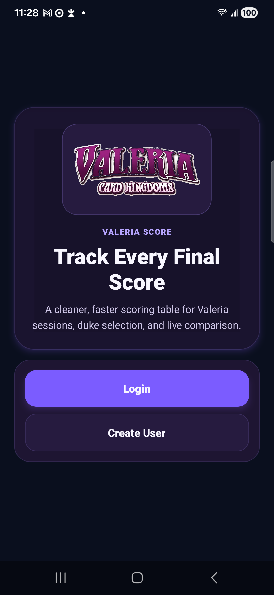
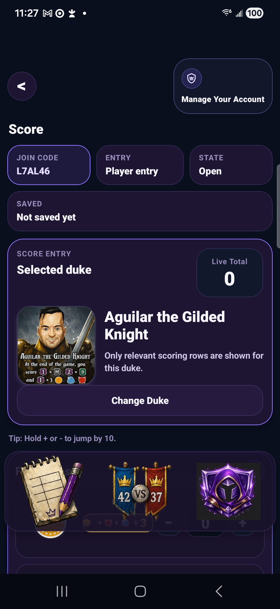
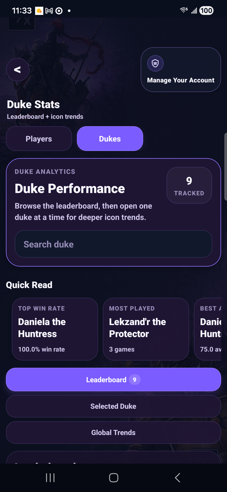

# Valeria Score


A fan-made score keeper and campaign companion for **Valeria: Card Kingdoms**.
Built with Expo (React Native) on a Supabase backend.

This project demonstrates end-to-end product ownership: interaction design,
realtime multiplayer state, offline-tolerant mobile behavior, database security,
analytics, automated testing, and Android release operations.

## What it does

- **Live tables** — host a session, share a 6-character join code or a
  scannable QR, and every player scores their own seat with realtime sync.
- **Full scoring engine** — per-duke multipliers for all 24 dukes, autosaved
  drafts, offline-tolerant saves, tiebreak resolution, and locked recaps.
- **Analytics** — duke win rates and input profiles, player stats and
  head-to-heads, global trends, and percentile comparisons.
- **Solo mode** — score battles against the Dark Lord with their own stats.
- **Guests** — seat players without accounts; they can claim their stats
  later by converting the guest Player ID into an account.
- **History** — recaps of every finished game plus CSV export.

## Product tour

| Join a table | Score together | Learn from the results |
| --- | --- | --- |
|  |  |  |

## Engineering highlights

- Supabase Auth, Postgres, row-level security, and edge functions keep account,
  guest, and game data boundaries explicit.
- Locked game recaps, idempotent completion notifications, and migration-drift
  checks protect data integrity across retries and releases.
- CI runs the test suite, TypeScript, ESLint, a static web export, and a check
  that committed migrations match production history.
- EAS build, submit, and over-the-air update workflows support repeatable Android
  delivery without committing release credentials.

## Development

```bash
npm install
npx expo start          # Metro dev server (Android dev client / web)
npm test                # node:test suite
npx tsc --noEmit        # typecheck
npx expo lint           # eslint
```

Copy `.env.example` to `.env` and fill in the Supabase project values before
running. The `android/` folder is generated (gitignored); EAS builds prebuild
from `app.json`, so config changes belong there, not in native files.

## Builds and releases

```bash
npm run publish:android            # build + submit to the Play internal track
npm run build:android:production   # EAS cloud build -> Play AAB
npm run build:android:apk         # internal-distribution APK
eas update --channel production   # ship a JS-only fix over the air
```

Publishing needs a Google Play service account key at
`play-service-account.json`; `npm run check:play-creds` verifies it against the
Play API. Release credentials, push-notification setup (Sentry, FCM), and the
OTA runtime-version rules live in
[docs/release-setup.md](docs/release-setup.md).

## Backend

Supabase (Postgres + RLS + edge functions). Migrations live in
`supabase/migrations/` and their filenames match the versions recorded in
production — CI's `migration-drift` job fails if they ever disagree. Edge
functions deploy automatically from `main` via GitHub Actions.
